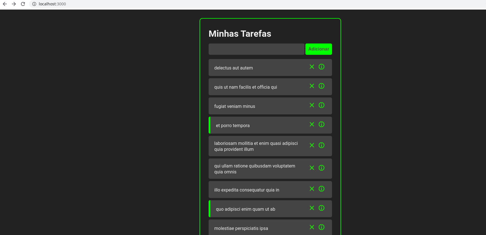

# Lista de Tafefas feita em React JS

Uma lista simples onde é possível incluir uma tarefa, visualizar suas observações, marcar como concluída e excluir.
O software faz uma chamada ao endpoint da API https://jsonplaceholder.cypress.io/todos?_limit=10

# Tecnologias utilizadas
 - React Js;
 - Axios;
 - React Router Dom.
 
 

